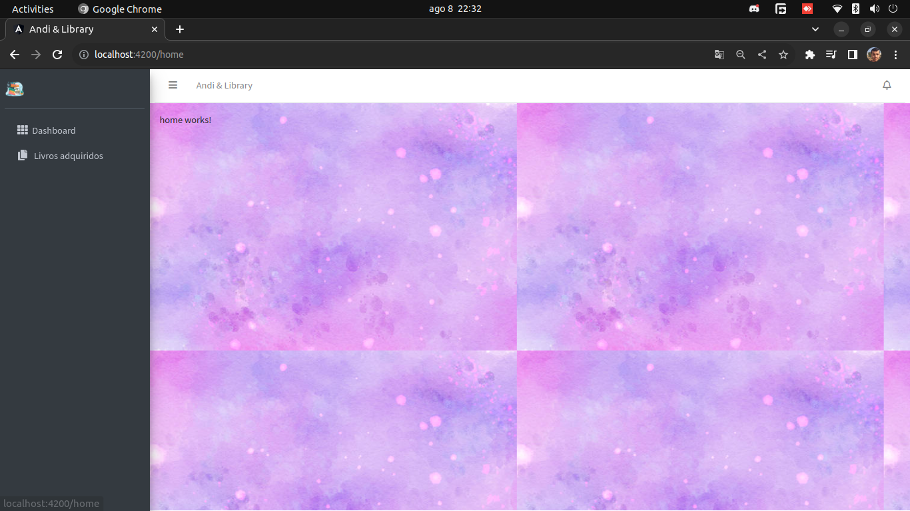
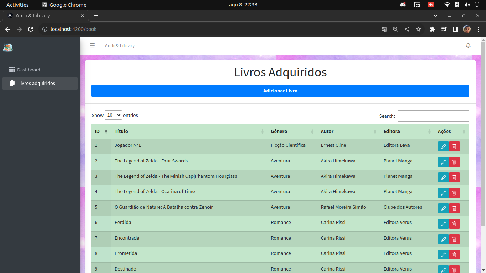
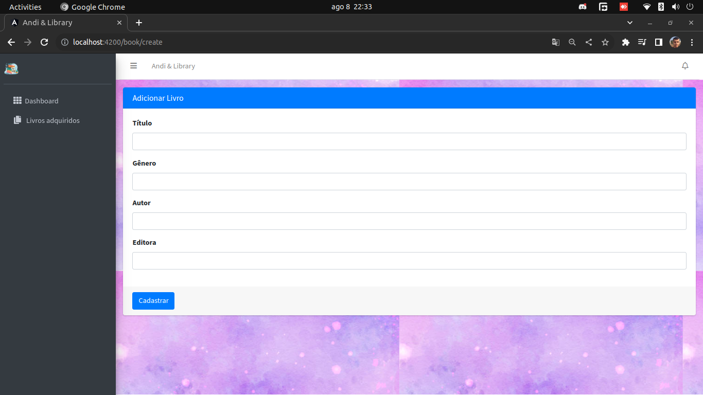
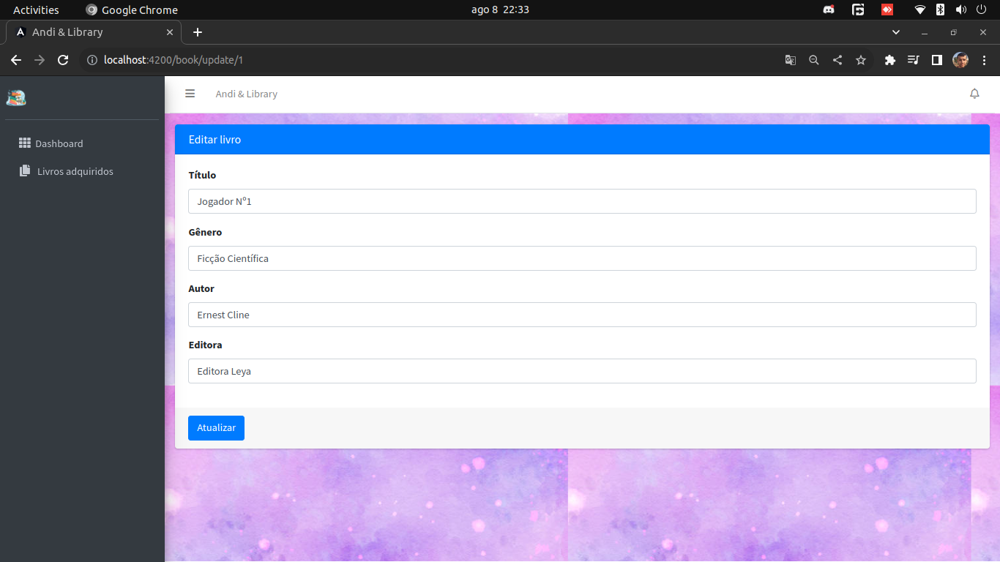

# Andi & Library: Aplicação de gerenciamento para sua biblioteca

Este projeto é uma pequena aplicação onde você consegue organizar sua biblioteca pessoal e ter um controle de quais livros você possui.
Ele é um projeto de estudos para aplicar os conhecimentos abaixo:

Back-end:
- O uso do SQL Alchemy;
- Implementação do FastAPI para requisições;
- Com o SQL Alchemy, a utilização de um banco de dados simples (SQLite);
- Aprendizado com um modelo de arquitetura de software baseado no MVC;
- Utilizar os conceitos de orientação à objetos;

Front-end:
- Realizar a componentização das telas;
- Trabalhar rotas;
- Trabalhar comunicação front-end/back-end;

As tecnologias utilizadas no momento foram Python, FastAPI, SQL Alchemy no back-end e Angular no front-end.

## Back-end
### Requisitos para rodar a aplicação

- `sudo apt-get install python3.8-full`
- `pip install fastapi==0.100.0`
- `pip install pip-chill==1.0.3`
- `pip install uvicorn==0.22.0`
- `pip install sqlalchemy==2.0.19`

### Requisições da API

- Adicionar um livro: `[post] localhost:8000/book/create`
- Listar livros: `[get] localhost:8000/book/list`
- Atualizar um livro: `[put] localhost:8000/book/update/{id}`
- Remover um livro: `[delete] localhost:8000/book/remove/{id}`
- Buscar info de um livro: `[get] localhost:8000/book/get/{id}`

### Corpo do JSON para criar e atualizar o livro

```json
{
  "title": "O Guardião de Nature: A Batalha Contra Zenoir",
  "genre": "Aventura",
  "author": "Rafael Moreira Simão",
  "publishing_company": "Clube dos Autores"
}
```

## Front-end
### Requisitos para rodar a aplicação

- `Node.js v18.16.1`
- `npm v9.5.1`
- `npm install -g @angular/cli`
- `npm install ngx-toastr@17.0.2`
- `npm install datatables.net-dt@1.13.6`

### Como rodar a aplicação

- `ng serve`

### Telas

- Home:



- Lista de livros:



- Adicionar livro:



- Editar livro:




## Implementações futuras

A próxima idéia é desenvolver uma aplicação mobile para fazer o consumo da API. A tecnologia utilizada será o ReactNative.

## Bugs & Futuras melhorias

- Na hora de remover um item da lista, ela não atualiza na hora e o DataTable jQuery manda um 'alert' sobre o erro. [bug]
- Imagem do background precisa ser reajustada (talvez trocada por uma melhor opção) [melhoria]
